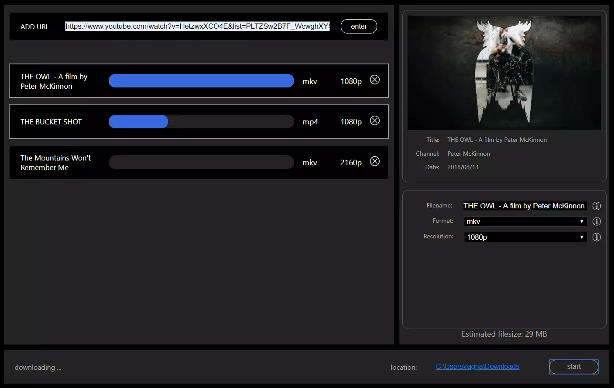

# JaguarDownloader
JaguarDownloader is a simple user interface for downloading youtube videos. The program is based on the popular downloading tool [youtube-dl](https://github.com/ytdl-org/youtube-dl) together with the open-source codec tool FFMPEG. The GUI is built on electron and Vue.js.

More information and an installer for windows are provided on [my website](http://jaguardownloader.me/).
Please note that this is one of my first projects and is more about the learning experience than the actual usefulness.

## Core Features
- Choose between multiple formats, converting if necessary.
- Downloading multiple videos at the same time.
- Select resolution.
- Download playlists.
## In development
- Automatic mp3 tagging using Spotify api.
## Screenshot

