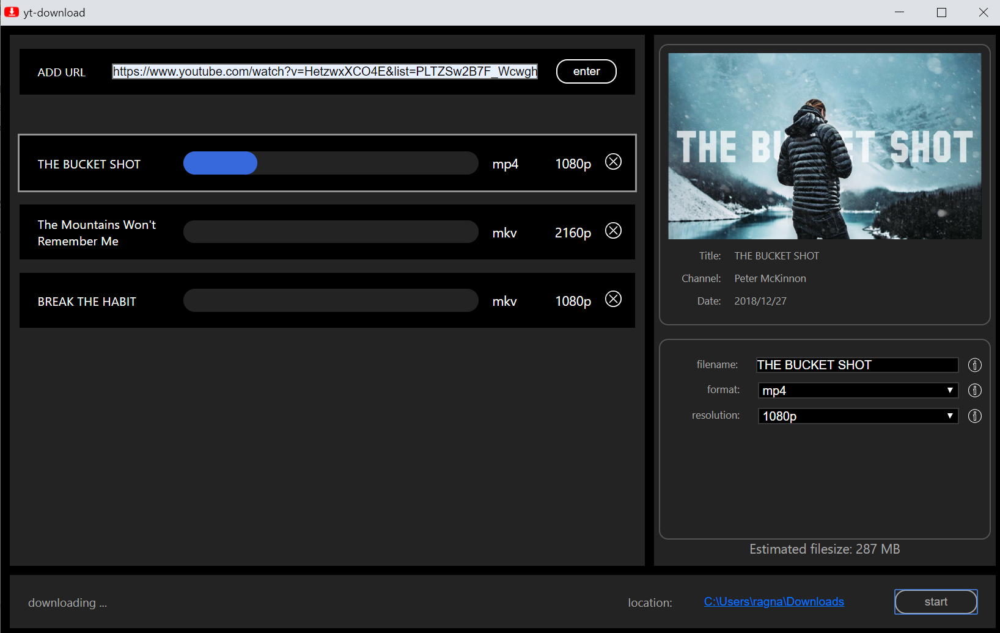

# Yt-download
Yt-download is a simple user interface for downloading youtube videos. The program is based on the popular downloading tool [youtube-dl](https://github.com/ytdl-org/youtube-dl). The GUI consists of a Flask webserver, serving a webpage made with [Vue.js](https://github.com/vuejs). The reason for this approach is the lack of good Python gui frameworks.

More information and an installer for windows are provided on [my website](https://yt-download.netlify.com/).
Please note that this is one of my first projects and is more about the learning experience than the actual usefulness.

## Core Features: 
- downloading multiple videos at the same time
- select resolution
- download playlists
- create mp3 tags

## Screenshots
